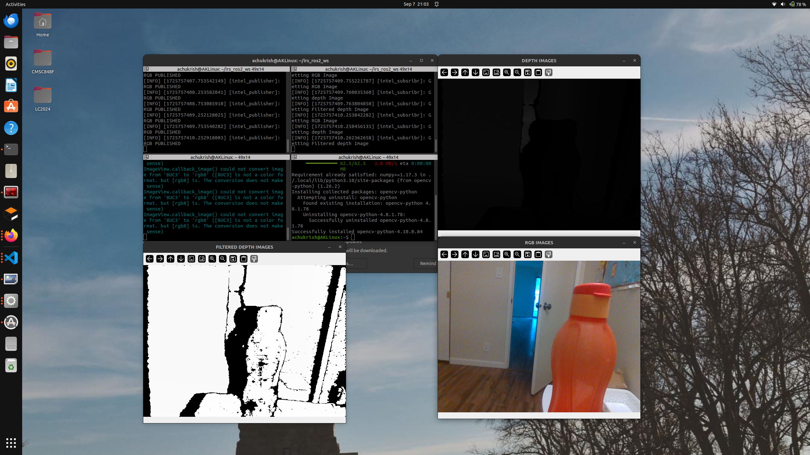

# Intel RealSense Hardware in the Loop
09/07 - Start with PubSub
09/08 - MaskRCNN and Object Detection
09/14 - Weak Projection and PCL Creation
09/15 - PCL segementation map using PointNet

## Progress 

